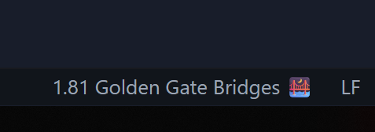

# HowLong?

_Ever wondered how long your code really is? Not just in lines, but in centimeters, bananas, or Eiffel Towers?_

---

## ⚠️ Calibration Required!

**For accurate measurements, calibrate first!**

Use the command `HowLong: Calibrate File Length Measurement (howlong.calibrate)` to set your screen's character size. This ensures the extension gives you correct physical length estimates for your code files.

## Features

- **Status Bar Length Display:** See the physical length of your current file in the VS Code status bar.
- **Fun Formats:** Cycle between metric, US, time-to-travel, and fun comparisons (bananas, buses, Eiffel Towers, etc).
- **Calibration:** Calibrate for your screen and font size for accurate measurements.
- **Quick Format Switching:** Click the status bar to change display format instantly.

## 🚀 Getting Started

1. **Install the extension** from the [Marketplace](https://marketplace.visualstudio.com/items?itemName=webry.howlong).
2. **Calibrate:**
	- Run the command `HowLong: Calibrate File Length Measurement`.
	- Copy the test text (100 characters), paste into your editor, and measure with a ruler.
	- Rerun command and enter the measured length (in cm or inches) when prompted.
3. **View your code's length** in the status bar. Click to cycle formats!

## 🛠️ Commands

- `HowLong: Calibrate File Length Measurement` – Set up your screen for accurate results.
- `HowLong: Cycle File Length Format` – Switch between metric, US, time, and fun formats.

## Example Output

- `3.2 bananas 🍌`
- `1.5 rulers 📏`
- `2.1 meters`
- `8.3 ft`
- `12s walking 🚶`

## Why?

So you can tell when your code is "too long" in a way that makes sense to you! Whether it's measuring in bananas, rulers, or even how long it would take to walk across your code.

## Disclaimer

I'm not responsible for any harm caused by measuring your code in light-years or comparing it to the Great Wall of China! 😉

## Contributing

Pull requests and suggestions are welcome! See [CHANGELOG.md](CHANGELOG.md) for updates.

---

_Made with ❤️ for developers who measure twice and code once._

